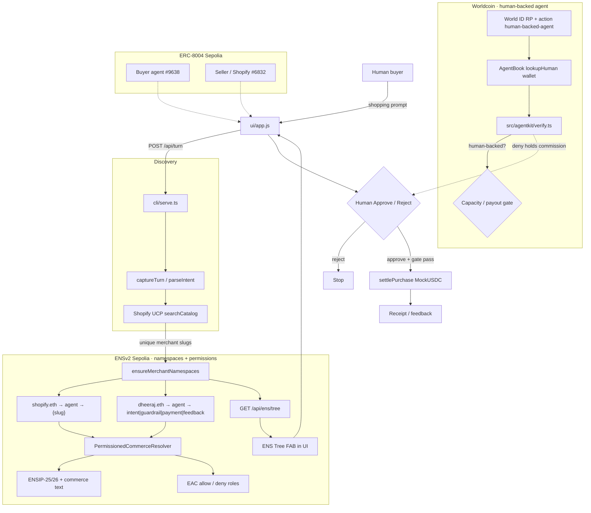

# worldCommerce

ENSv2 agent namespaces for Shopify UCP commerce — buyer roles under `dheeraj.eth`, merchant agents under `shopify.eth`, ERC-8004 identity, Sepolia MockUSDC settlement, and World AgentKit human-backing.

**Live demo:** [https://worldcommerce-production.up.railway.app](https://worldcommerce-production.up.railway.app)  
**Presentation:** [View the worldCommerce presentation](https://canva.link/e4y3bs07jpn2opb)

## Final Submission


| Field                | Value                                                                                   |
| -------------------- | --------------------------------------------------------------------------------------- |
| **Project**          | worldCommerce                                                                           |
| **Track focus**      | ENSv2 (Sepolia hackathon) · ERC-8004 · Shopify UCP · x402-style settlement              |
| **Demo**             | Split-screen buyer × Shopify agents + bottom-left **ENS Tree**                          |
| **Chain**            | Ethereum Sepolia (ENS, 8004, MockUSDC)                                                  |
| **Buyer agent**      | ERC-8004 `#9638` · `agent.dheeraj.eth`                                                  |
| **Seller / Shopify** | ERC-8004 `#6832` · `agent.shopify.eth`                                                  |
| **Repo**             | [dhru7777/ethonline-worldcommerce](https://github.com/dhru7777/ethonline-worldcommerce) |
| **Presentation**     | [View presentation](https://canva.link/e4y3bs07jpn2opb)                                |


## Product Rule

The agent works for the human

```text
Intent → discover eligible offers → guardrails / capacity → human approve
→ pay merchant (MockUSDC) → optional commission path → receipt / feedback
```

Merchant ENS labels are derived from **this search’s UCP hits**, not a hard-coded brand list. Removing ENSv2 breaks namespace resolution and the permission demo.

## End-to-End Loop

```text
User Intent
→ Buyer agent (ERC-8004)
→ Shopify UCP discovery
→ Lazy ENS ensure: {slug}.agent.shopify.eth
→ Permissioned resolver text (ENSIP-25/26 + commerce keys)
→ EAC allow / deny demo
→ worldAgent capacity (AgentKit / AgentBook)
→ Human Approve / Reject
→ Sepolia MockUSDC pay merchant
→ Optional Merchant1 → buyer commission
→ Receipt / feedback
```


## Low-Level Design

Two rails sit beside discovery and settlement:

1. **ENSv2** — who each agent/merchant *is* on-chain (nested registries, permissioned text, EAC).
2. **Worldcoin AgentKit** — whether the buyer agent is *human-backed* (AgentBook + World ID) before capacity / payout proceeds.




### What ENS owns


| Piece                                    | Role                                                                           |
| ---------------------------------------- | ------------------------------------------------------------------------------ |
| `shopify.eth` / `dheeraj.eth` head names | Parent registries on ETHOnline Sepolia                                         |
| Nested `UserRegistry` (`ens-contracts/`) | Subnames: merchants under `agent.shopify.eth`, roles under `agent.dheeraj.eth` |
| `PermissionedCommerceResolver`           | Text records + EAC (Shopify admin vs merchant operator)                        |
| ENSIP-25 / 26                            | Agent registration + endpoint / context keys                                   |
| UI **ENS Tree**                          | Read model of both forests (`/api/ens/tree`)                                   |


Without ENSv2, merchant labels and the permission demo do not resolve.

### What Worldcoin owns


| Piece                             | Role                                                        |
| --------------------------------- | ----------------------------------------------------------- |
| World ID RP (`WORLD_ID_*`)        | Cloud verify action `human-backed-agent`                    |
| AgentBook (`@worldcoin/agentkit`) | `lookupHuman(buyerWallet)` on World Chain                   |
| `verifyAgentHumanBacked`          | Gate used before capacity / payout                          |
| `AGENTKIT_ASSUME_HUMAN_BACKED`    | Demo allow path until the wallet is registered in World App |


ENS answers **naming + permissions**. Worldcoin answers **human continuity** for the buyer agent. ERC-8004 is separate identity/reputation on Sepolia.


| Boundary       | Owner                          | Contract                                                 |
| -------------- | ------------------------------ | -------------------------------------------------------- |
| Demo HTTP      | `cli/serve.ts`                 | Serves `ui/` + health, turn, discover, ENS tree, wallets |
| ENS trees      | `src/ens/*` + `ens-contracts/` | Nested UserRegistry + PermissionedCommerceResolver       |
| Worldcoin gate | `src/agentkit/`                | AgentBook lookup + World ID RP config                    |
| Discovery      | `src/ucp/`                     | Shopify UCP → merchant labels                            |
| Settlement     | `src/payments/`                | Sepolia MockUSDC + commission BPS                        |
| ERC-8004       | `src/identity/`                | Buyer `#9638` · Seller `#6832`                           |


## Naming


| Side       | Names                                                                     |
| ---------- | ------------------------------------------------------------------------- |
| **Seller** | `shopify.eth` → `agent` → `lindt` / UCP slugs → optional `commission…`    |
| **Buyer**  | `dheeraj.eth` → `agent` → `intent` · `guardrail` · `payment` · `feedback` |


Ops (Sepolia live writes):

```bash
npm run ens:deploy
npm run ens:live
```


## AgentKit

```bash
npm run agentkit:prereq
npm run agentkit:status
# after World ID in World App:
npm run agentkit:register
```

See [docs/agentkit.md](docs/agentkit.md).

## API

- `GET /api/health` — ENS mode + identities
- `GET /api/ens/tree` — buyer × seller forest for the UI panel
- `GET /api/identities` · `/api/agent/{buyer\|seller}` · `/api/wallet/{buyer\|seller}`
- `POST /api/turn` — multi-turn intent → UCP + ENS
- `POST /api/discover` — one-shot discovery

`ENS_WRITE_MODE=dry-run` (safe default) builds namespaces without txs. Use `live` + deployer key for Sepolia writes.

## Docs

- [Architecture](docs/architecture.md)
- [AgentKit](docs/agentkit.md)
- [World product feedback](docs/world-product-feedback.md) (AgentKit / AgentBook / World ID)
- [ENS product feedback](docs/ens-product-feedback.md) (ENSv2 Sepolia App / HCA / nested registries)
- **ETHOnline ENSv2 Sepolia (not production ENS docs):**
  - [Deployments](https://feature-permres-inode-refact.docs-bao.pages.dev/learn/deployments#sepolia-ensv2-beta)
  - [ENSv2 overview](https://feature-permres-inode-refact.docs-bao.pages.dev/ensv2/overview)
  - [ENS Explorer](https://hackathon-deployment-portal-app.ens-cf.workers.dev/)
  - [ENS App](https://hackathon-deployment-manager-app-v4.ens-cf.workers.dev/)
- [ENSIP-25](https://docs.ens.domains/ensip/25/) · [ENSIP-26](https://docs.ens.domains/ensip/26/)

