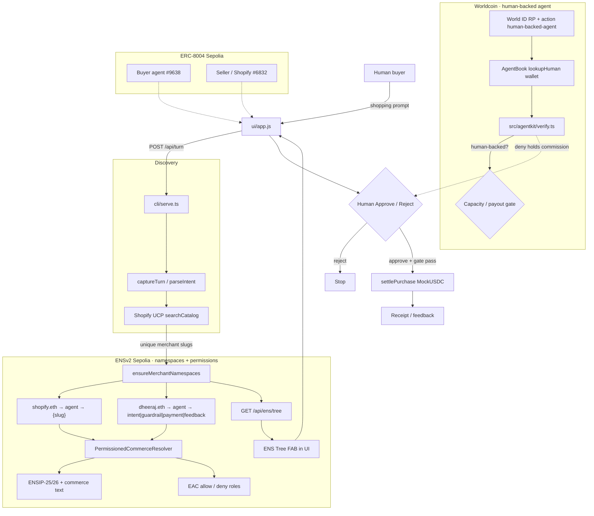

# worldCommerce

Shopping agents today are hex wallets: no name, no scoped permissions, and no proof they spend for a real person. Merchants will pay a commission to get chosen without a unique-human check that payout is bounty farming. Catalog hits have no on-chain identity unless you hard-code brands.

worldCommerce is agentic Shopify UCP commerce where the agent works for the human. Buyer roles live under `dheeraj.eth`, merchants under `shopify.eth` (ENSv2 + EAC). ERC-8004 is who the agents are. World AgentKit decides whether they are human-backed before commission releases. Sepolia MockUSDC settles only after the human approves.

**Live demo:** [https://worldcommerce-production.up.railway.app](https://worldcommerce-production.up.railway.app)

## Final Submission


| Field                | Value                                                                                   |
| -------------------- | --------------------------------------------------------------------------------------- |
| **Project**          | worldCommerce                                                                           |
| **Track focus**      | ENSv2 (Sepolia hackathon) · ERC-8004 · Shopify UCP · x402-style settlement              |
| **Demo**             | Split-screen buyer × Shopify agents + bottom-left **ENS Tree** + Worldlookup                         |
| **Showcase**         | [ETHGlobal showcase](https://ethglobal.com/showcase/world-commerce-om3cg) |
| **Chain**            | Ethereum Sepolia (ENS, MockUSDC) · ERC-8004 on Sepolia + Base Sepolia   + Worldchain                 |
| **Buyer agent**      | ERC-8004 [`#9638` Sepolia](https://testnet.8004scan.io/agents/sepolia/9638) · [`agent.dheeraj.eth`](https://hackathon-deployment-portal-app.ens-cf.workers.dev/agent.dheeraj.eth) |
| **Seller / Shopify** | ERC-8004 [`#6832` Base Sepolia](https://testnet.8004scan.io/agents/base-sepolia/6832?tab=services) · [`agent.shopify.eth`](https://hackathon-deployment-portal-app.ens-cf.workers.dev/agent.shopify.eth) |
| **Repo**             | [dhru7777/ethonline-worldcommerce](https://github.com/dhru7777/ethonline-worldcommerce) |
| **Presentation**     | [View presentation](https://canva.link/e4y3bs07jpn2opb)                                |


## On-chain links

Explorer: [ETHOnline ENSv2 Sepolia](https://hackathon-deployment-portal-app.ens-cf.workers.dev/). Nested `UserRegistry` contracts show as **Subregistry** on each name; **Subnames** lists children under that registry.

### ERC-8004


| Agent          | Chain                   | 8004scan                                                                                                                       |
| -------------- | ----------------------- | ------------------------------------------------------------------------------------------------------------------------------ |
| Buyer `#9638`  | Ethereum Sepolia        | [testnet.8004scan.io/agents/sepolia/9638](https://testnet.8004scan.io/agents/sepolia/9638)                                     |
| Seller `#6832` | Base Sepolia · services | [testnet.8004scan.io/agents/base-sepolia/6832?tab=services](https://testnet.8004scan.io/agents/base-sepolia/6832?tab=services) |


### AgentBook (World Chain)

Buyer wallet `0xCD6430…9D91` is Orb-registered on AgentBook. Live `lookupHuman` returns human `0x2493…7ff4`.

| Piece | Link |
| ----- | ---- |
| Register tx | [worldscan.org/tx/0x25e4710c…b1e4](https://worldscan.org/tx/0x25e4710cc1432567536c3a72e35a1aac53a421a1689a7abbc449ce0c271bb1e4) |
| AgentBook | [`0xA23aB2712eA7BBa896930544C7d6636a96b944dA`](https://worldscan.org/address/0xA23aB2712eA7BBa896930544C7d6636a96b944dA) |


### Buyer tree — `dheeraj.eth`


| Name                          | Explorer                                                                                                                                                                               | Subnames                                                                                                    | Subregistry                                                                                                                     |
| ----------------------------- | -------------------------------------------------------------------------------------------------------------------------------------------------------------------------------------- | ----------------------------------------------------------------------------------------------------------- | ------------------------------------------------------------------------------------------------------------------------------- |
| `dheeraj.eth`                 | [name](https://hackathon-deployment-portal-app.ens-cf.workers.dev/dheeraj.eth) · [records](https://hackathon-deployment-portal-app.ens-cf.workers.dev/dheeraj.eth/records)             | [subnames](https://hackathon-deployment-portal-app.ens-cf.workers.dev/dheeraj.eth/subnames)                 | [`0xC22c…9358`](https://hackathon-deployment-portal-app.ens-cf.workers.dev/registry/0xC22c46275CaAb58A9b1f1ffF6C30B7231c959358) |
| `agent.dheeraj.eth`           | [name](https://hackathon-deployment-portal-app.ens-cf.workers.dev/agent.dheeraj.eth) · [records](https://hackathon-deployment-portal-app.ens-cf.workers.dev/agent.dheeraj.eth/records) | [subnames](https://hackathon-deployment-portal-app.ens-cf.workers.dev/agent.dheeraj.eth/subnames)           | [`0x20e7…05fb`](https://hackathon-deployment-portal-app.ens-cf.workers.dev/registry/0x20e7fC9bdD809095c6C3958D6Ee084957F7A05fb) |
| `intent.agent.dheeraj.eth`    | [name](https://hackathon-deployment-portal-app.ens-cf.workers.dev/intent.agent.dheeraj.eth)                                                                                            | [subnames](https://hackathon-deployment-portal-app.ens-cf.workers.dev/intent.agent.dheeraj.eth/subnames)    | —                                                                                                                               |
| `guardrail.agent.dheeraj.eth` | [name](https://hackathon-deployment-portal-app.ens-cf.workers.dev/guardrail.agent.dheeraj.eth)                                                                                         | [subnames](https://hackathon-deployment-portal-app.ens-cf.workers.dev/guardrail.agent.dheeraj.eth/subnames) | —                                                                                                                               |
| `payment.agent.dheeraj.eth`   | [name](https://hackathon-deployment-portal-app.ens-cf.workers.dev/payment.agent.dheeraj.eth)                                                                                           | [subnames](https://hackathon-deployment-portal-app.ens-cf.workers.dev/payment.agent.dheeraj.eth/subnames)   | —                                                                                                                               |
| `feedback.agent.dheeraj.eth`  | [name](https://hackathon-deployment-portal-app.ens-cf.workers.dev/feedback.agent.dheeraj.eth)                                                                                          | [subnames](https://hackathon-deployment-portal-app.ens-cf.workers.dev/feedback.agent.dheeraj.eth/subnames)  | —                                                                                                                               |


Buyer wallet names: [`0xCD64…9D91`](https://hackathon-deployment-portal-app.ens-cf.workers.dev/addr/0xCD643061B9a5D96AD8595B252fE098EA33a39D91/names)

### Seller tree — `shopify.eth`


| Name                | Explorer                                                                                                                                                                               | Subnames                                                                                          | Subregistry                                                                                                                     |
| ------------------- | -------------------------------------------------------------------------------------------------------------------------------------------------------------------------------------- | ------------------------------------------------------------------------------------------------- | ------------------------------------------------------------------------------------------------------------------------------- |
| `shopify.eth`       | [name](https://hackathon-deployment-portal-app.ens-cf.workers.dev/shopify.eth) · [records](https://hackathon-deployment-portal-app.ens-cf.workers.dev/shopify.eth/records)             | [subnames](https://hackathon-deployment-portal-app.ens-cf.workers.dev/shopify.eth/subnames)       | [`0x76fE…0B54`](https://hackathon-deployment-portal-app.ens-cf.workers.dev/registry/0x76fE166152b3CbcF62bECBEC5087DfE8C3b00B54) |
| `agent.shopify.eth` | [name](https://hackathon-deployment-portal-app.ens-cf.workers.dev/agent.shopify.eth) · [records](https://hackathon-deployment-portal-app.ens-cf.workers.dev/agent.shopify.eth/records) | [subnames](https://hackathon-deployment-portal-app.ens-cf.workers.dev/agent.shopify.eth/subnames) | [`0xE9A9…1B5b`](https://hackathon-deployment-portal-app.ens-cf.workers.dev/registry/0xE9A977275D5af1d30cC84EfC8b96Ce80Fd0f1B5b) |


Merchant leaves (`lindt.agent.shopify.eth`, UCP slugs, `commission.{slug}.agent.shopify.eth`) are minted under the `agent.shopify.eth` subregistry from this search’s hits — open **Subnames** on `agent.shopify.eth`.

## Product Rule

The agent works for the human

```text
Intent → discover eligible offers → guardrails / capacity → human approve
→ pay merchant (MockUSDC) → optional commission path → receipt / feedback
```

Merchant ENS labels are derived from **this search’s UCP hits**, not a hard-coded brand list. Removing ENSv2 breaks namespace resolution and the permission demo.

## End-to-End Loop

```text
User Intent
→ Buyer agent (ERC-8004)
→ Shopify UCP discovery
→ Lazy ENS ensure: {slug}.agent.shopify.eth
→ Permissioned resolver text (ENSIP-25/26 + commerce keys)
→ EAC allow / deny demo
→ worldAgent capacity (AgentKit / AgentBook)
→ Human Approve / Reject
→ Sepolia MockUSDC pay merchant
→ Optional Merchant1 → buyer commission
→ Receipt / feedback
```


## Low-Level Design

Two rails sit beside discovery and settlement:

1. **ENSv2** — who each agent/merchant *is* on-chain (nested registries, permissioned text, EAC).
2. **Worldcoin AgentKit** — whether the buyer agent is *human-backed* (AgentBook + World ID) before capacity / payout proceeds.




### What ENS owns


| Piece                                    | Role                                                                           |
| ---------------------------------------- | ------------------------------------------------------------------------------ |
| `shopify.eth` / `dheeraj.eth` head names | Parent registries on ETHOnline Sepolia                                         |
| Nested `UserRegistry` (`ens-contracts/`) | Subnames: merchants under `agent.shopify.eth`, roles under `agent.dheeraj.eth` |
| `PermissionedCommerceResolver`           | Text records + EAC (Shopify admin vs merchant operator)                        |
| ENSIP-25 / 26                            | Agent registration + endpoint / context keys                                   |
| UI **ENS Tree**                          | Read model of both forests (`/api/ens/tree`)                                   |


Without ENSv2, merchant labels and the permission demo do not resolve.

### What Worldcoin owns


| Piece                             | Role                                                  |
| --------------------------------- | ----------------------------------------------------- |
| World ID RP (`WORLD_ID_*`)        | Cloud verify action `human-backed-agent`              |
| AgentBook (`@worldcoin/agentkit`) | `lookupHuman(buyerWallet)` on World Chain · [register tx](https://worldscan.org/tx/0x25e4710cc1432567536c3a72e35a1aac53a421a1689a7abbc449ce0c271bb1e4) |
| `verifyAgentHumanBacked`          | Gate used before capacity / payout                    |
| `AGENTKIT_ASSUME_HUMAN_BACKED`    | Labeled demo mock when live AgentBook lookup is empty |


ENS answers **naming + permissions**. Worldcoin answers **human continuity** for the buyer agent. ERC-8004 is separate identity/reputation on Sepolia.


| Boundary       | Owner                          | Contract                                                 |
| -------------- | ------------------------------ | -------------------------------------------------------- |
| Demo HTTP      | `cli/serve.ts`                 | Serves `ui/` + health, turn, discover, ENS tree, wallets |
| ENS trees      | `src/ens/*` + `ens-contracts/` | Nested UserRegistry + PermissionedCommerceResolver       |
| Worldcoin gate | `src/agentkit/`                | AgentBook lookup + World ID RP config                    |
| Discovery      | `src/ucp/`                     | Shopify UCP → merchant labels                            |
| Settlement     | `src/payments/`                | Sepolia MockUSDC + commission BPS                        |
| ERC-8004       | `src/identity/`                | Buyer `#9638` · Seller `#6832`                           |


## Naming


| Side       | Names                                                                     |
| ---------- | ------------------------------------------------------------------------- |
| **Seller** | `shopify.eth` → `agent` → `lindt` / UCP slugs → optional `commission…`    |
| **Buyer**  | `dheeraj.eth` → `agent` → `intent` · `guardrail` · `payment` · `feedback` |


Ops (Sepolia live writes):

```bash
npm run ens:deploy
npm run ens:live
```


## AgentKit

**AgentBook register (World Chain):** [worldscan.org/tx/0x25e4710c…b1e4](https://worldscan.org/tx/0x25e4710cc1432567536c3a72e35a1aac53a421a1689a7abbc449ce0c271bb1e4)

```bash
npm run agentkit:prereq
npm run agentkit:status
# after World ID in World App (Orb — Sandbox cannot finish this):
npm run agentkit:register
```

See [docs/agentkit.md](docs/agentkit.md) · [Continuity log](docs/world-continuity-implementation-log.md).

AgentKit in this demo:

1. **AgentBook lookup** on commission (`POST /api/settle`) — human-backed → release bid; else hold.
2. **Steps 3–5** on merchant-bid catalog — `createAgentkitClient` + `createAgentkitHooks` + `InMemoryAgentKitStorage` `free-trial` (3) on `GET /api/agentkit/data`. Unregistered / exhausted → HTTP 402. This is World’s x402 access path. Commission is still the commerce incentive.


### Why the demo mocks human-backed

World’s AgentBook ([`0xA23aB2712eA7BBa896930544C7d6636a96b944dA`](https://worldscan.org/address/0xA23aB2712eA7BBa896930544C7d6636a96b944dA) on World Chain) only **writes** after a production **Orb** proof. That write is [this register tx](https://worldscan.org/tx/0x25e4710cc1432567536c3a72e35a1aac53a421a1689a7abbc449ce0c271bb1e4). World ID Sandbox cannot register `0xCD6430…`. There is no sandbox AgentBook contract that accepts Sandbox proofs.

We still **use** AgentBook here:

1. Every guardrail / settle call runs live `lookupHuman(buyerWallet)`.
2. That currently returns `null` (unregistered) — the honest on-chain status.
3. `AGENTKIT_ASSUME_HUMAN_BACKED=true` then overlays a **labeled mock** (`checkedVia: agentbook-mock`) so the UI can show **human-backed → commission release**.

That is the product we considered for this settle path: a human-backed buyer agent gets the merchant bid; a bot does not. Without the mock, every Orb-less demo would only show **hold**, and it would look like we never wired the release side.

The header chip **AgentBook mock** and the worldAgent bubble say this out loud. Judges are not meant to think Orb succeeded.


| Flag                                          | Demo shows                                               |
| --------------------------------------------- | -------------------------------------------------------- |
| `AGENTKIT_ASSUME_HUMAN_BACKED=true` (default) | Live lookup + mock human-backed + commission **release** |
| `AGENTKIT_ASSUME_HUMAN_BACKED=false`          | Live lookup miss + commission **hold**                   |


Selfie on Approve is a separate HITL check. World ID Sandbox Selfie Check is failing in TestFlight, so the demo mocks it (`WORLD_ID_MOCK_SELFIE=true`, header chip **Selfie mock**). Set `false` to try the real QR. It does not write AgentBook.

## API

- `GET /api/health` — ENS mode + identities
- `GET /api/ens/tree` — buyer × seller forest for the UI panel
- `GET /api/identities` · `/api/agent/{buyer\|seller}` · `/api/wallet/{buyer\|seller}`
- `GET /api/agentkit/verify` — AgentBook `lookupHuman` for the buyer wallet
- `GET /api/agentkit/data` — x402/AgentKit protected catalog (402 without signed `agentkit` header)
- `GET /api/agentkit/access` — buyer agent runs Step 3 sign + Step 4 hook (demo)
- `GET /api/worldid/config` · `POST /api/worldid/rp-signature` · `POST /api/worldid/verify` — Sandbox IDKit
- `POST /api/turn` — multi-turn intent → UCP + ENS
- `POST /api/discover` — one-shot discovery
- `POST /api/settle` — MockUSDC pay + commission hold/release

`ENS_WRITE_MODE=dry-run` (safe default) builds namespaces without txs. Use `live` + deployer key for Sepolia writes.

## Docs

- [Architecture](docs/architecture.md)
- [AgentKit](docs/agentkit.md)
- [World Continuity implementation log](docs/world-continuity-implementation-log.md) (rubric + Orb vs Sandbox)
- [World product feedback](docs/world-product-feedback.md) (AgentKit / AgentBook / World ID)
- [ENS product feedback](docs/ens-product-feedback.md) (ENSv2 Sepolia App / HCA / nested registries)
- **ETHOnline ENSv2 Sepolia (not production ENS docs):**
  - [Deployments](https://feature-permres-inode-refact.docs-bao.pages.dev/learn/deployments#sepolia-ensv2-beta)
  - [ENSv2 overview](https://feature-permres-inode-refact.docs-bao.pages.dev/ensv2/overview)
  - [ENS Explorer](https://hackathon-deployment-portal-app.ens-cf.workers.dev/)
  - [ENS App](https://hackathon-deployment-manager-app-v4.ens-cf.workers.dev/)
- [ENSIP-25](https://docs.ens.domains/ensip/25/) · [ENSIP-26](https://docs.ens.domains/ensip/26/)

