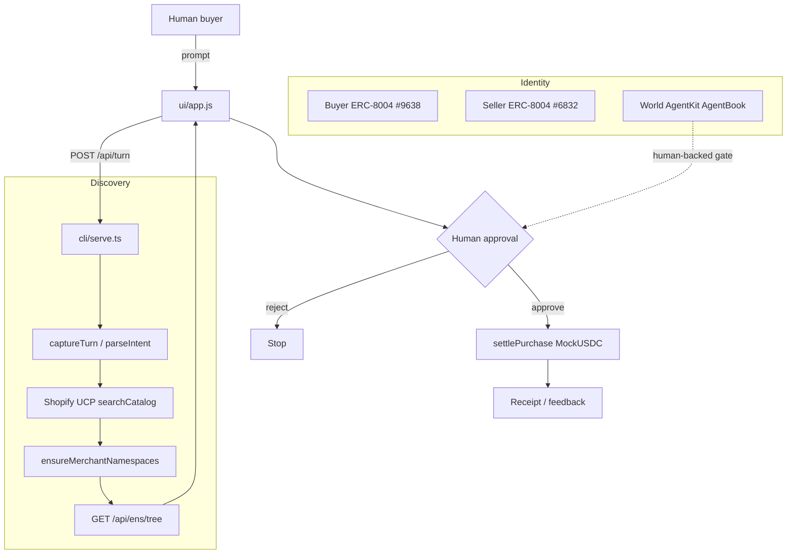

# worldCommerce

ENSv2 agent namespaces for Shopify UCP commerce — buyer roles under `dheeraj.eth`, merchant agents under `shopify.eth`, ERC-8004 identity, Sepolia MockUSDC settlement, and World AgentKit human-backing.

Forked from the [midnightx402](https://github.com/NikhilMahana/midnightx402) commerce-agent lineage (Nikhil Mahana) and rebuilt around **ENSv2 + ERC-8004 + Shopify UCP** for ETHOnline.

**Live demo:** [https://worldcommerce-production.up.railway.app](https://worldcommerce-production.up.railway.app)

## Final Submission

| Field | Value |
|---|---|
| **Project** | worldCommerce |
| **Track focus** | ENSv2 (Sepolia hackathon) · ERC-8004 · Shopify UCP · x402-style settlement |
| **Demo** | Split-screen buyer × Shopify agents + bottom-left **ENS Tree** |
| **Chain** | Ethereum Sepolia (ENS, 8004, MockUSDC) |
| **Buyer agent** | ERC-8004 `#9638` · `agent.dheeraj.eth` |
| **Seller / Shopify** | ERC-8004 `#6832` · `agent.shopify.eth` |
| **Repo** | [dhru7777/ethonline-worldcommerce](https://github.com/dhru7777/ethonline-worldcommerce) |

## Product Rule

The agent works for the human, not the highest bidder.

```text
Intent → discover eligible offers → guardrails / capacity → human approve
→ pay merchant (MockUSDC) → optional commission path → receipt / feedback
```

Merchant ENS labels are derived from **this search’s UCP hits**, not a hard-coded brand list. Removing ENSv2 breaks namespace resolution and the permission demo.

## Run the Unified Demo

```bash
cp .env.example .env
npm install
npm run demo
```

Open [http://localhost:5190](http://localhost:5190).

Try: `Find me chocolates under $10` → Approve the pick.

Bottom-left **ENS Tree** opens the live buyer × seller namespace forest (`dheeraj.eth` / `shopify.eth`) with explorer links.

## End-to-End Loop

```text
User Intent
→ Buyer agent (ERC-8004)
→ Shopify UCP discovery
→ Lazy ENS ensure: {slug}.agent.shopify.eth
→ Permissioned resolver text (ENSIP-25/26 + commerce keys)
→ EAC allow / deny demo
→ worldAgent capacity (AgentKit / AgentBook)
→ Human Approve / Reject
→ Sepolia MockUSDC pay merchant
→ Optional Merchant1 → buyer commission
→ Receipt / feedback
```

## Low-Level Design



| Boundary | Owner | Contract |
|---|---|---|
| Demo HTTP | `cli/serve.ts` | Serves `ui/` + health, turn, discover, ENS tree, wallets |
| ENS trees | `src/ens/*` + `ens-contracts/` | Nested UserRegistry + PermissionedCommerceResolver |
| Discovery | `src/ucp/` | Shopify UCP → merchant labels |
| Settlement | `src/payments/` | Sepolia MockUSDC + commission BPS |
| Human gate | `src/agentkit/` | AgentBook lookup (+ demo assume) |

## Naming

| Side | Names |
|---|---|
| **Seller** | `shopify.eth` → `agent` → `lindt` / UCP slugs → optional `commission…` |
| **Buyer** | `dheeraj.eth` → `agent` → `intent` · `guardrail` · `payment` · `feedback` |

Ops (Sepolia live writes):

```bash
npm run ens:deploy
npm run ens:live
```

## AgentKit

```bash
npm run agentkit:prereq
npm run agentkit:status
# after World ID in World App:
npm run agentkit:register
```

See [docs/agentkit.md](docs/agentkit.md).

## API

- `GET /api/health` — ENS mode + identities
- `GET /api/ens/tree` — buyer × seller forest for the UI panel
- `GET /api/identities` · `/api/agent/{buyer\|seller}` · `/api/wallet/{buyer\|seller}`
- `POST /api/turn` — multi-turn intent → UCP + ENS
- `POST /api/discover` — one-shot discovery

`ENS_WRITE_MODE=dry-run` (safe default) builds namespaces without txs. Use `live` + deployer key for Sepolia writes.

## Docs

- [Architecture](docs/architecture.md)
- [AgentKit](docs/agentkit.md)
- **ETHOnline ENSv2 Sepolia (not production ENS docs):**
  - [Deployments](https://feature-permres-inode-refact.docs-bao.pages.dev/learn/deployments#sepolia-ensv2-beta)
  - [ENSv2 overview](https://feature-permres-inode-refact.docs-bao.pages.dev/ensv2/overview)
  - [ENS Explorer](https://hackathon-deployment-portal-app.ens-cf.workers.dev/)
  - [ENS App](https://hackathon-deployment-manager-app-v4.ens-cf.workers.dev/)
- [ENSIP-25](https://docs.ens.domains/ensip/25/) · [ENSIP-26](https://docs.ens.domains/ensip/26/)
