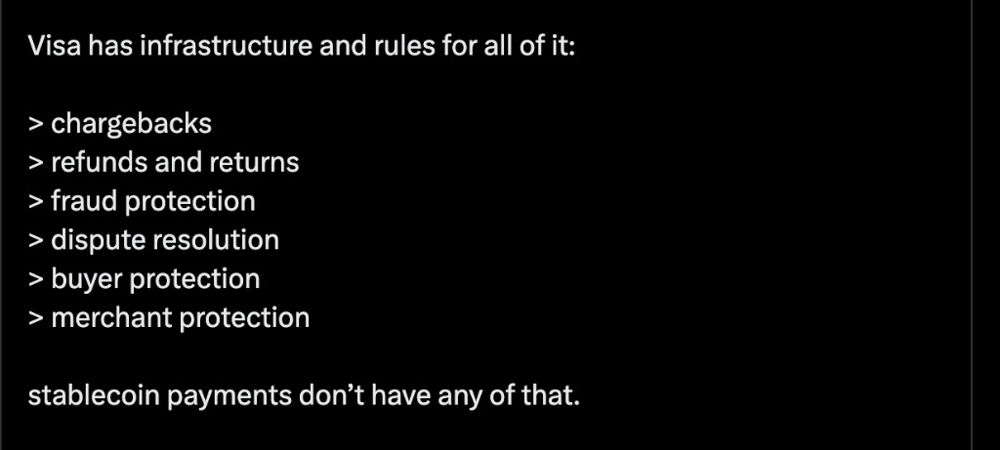
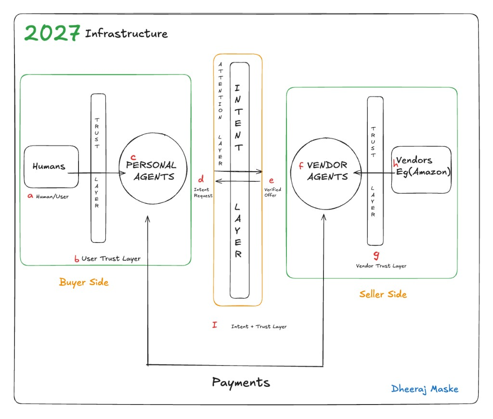
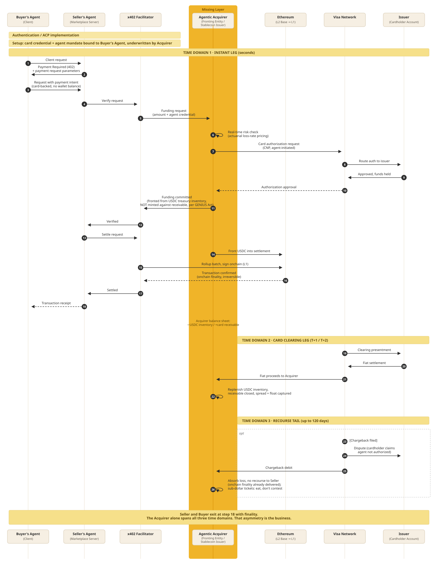

# Important Pillar of Agentic Payment Infrastructure

Software agents are starting to pay. Stablecoins already move the money. Everyday commerce still needs the protection layer that cards have and this rail does not.

Thanks to [Peter](https://www.linkedin.com/in/pbraunz/) for bouncing these ideas with me.

## Index

| Section | Question it answers |
| --- | --- |
| 1. Problem Statement | Why do stablecoin payments still fail at everyday commerce despite solving settlement? |
| 2. Market Opportunity | Why is this the right moment to build the protection layer stablecoins never had? |
| 3. Strategic Approach | What do we build first, and what does it set up for later? |
| 4. Engineering Architecture | How does the settlement flow actually work, step by step? |
| 5. Protection and Dispute Layer | How do we bring card-network-grade protections onto a stablecoin rail? |
| 6. Credit-Driven Agent Economy | What becomes possible once the infrastructure and protections both exist? |
| 7. Risks and Open Questions | What is still unresolved? |
| 8. Conclusion and Vision | What does this infrastructure look like five years out? |

## 1. Problem Statement

Software agents are starting to act on our behalf, not just recommend things to us. A personal agent can already search, compare, negotiate, and increasingly, pay. For most of the internet's history, humans clicked "buy." Soon, in a growing number of cases, an agent will.

Payments matter most in this shift because payments are where intent turns into a real financial commitment. Stablecoins solved the money-movement part: a payment can settle globally in seconds, for a fraction of a cent. That is why protocols like x402 exist.

But moving money is only one part of commerce. Online commerce works because of everything that happens after the money moves, or instead of it moving. A package does not arrive, and the buyer gets a refund. A card gets stolen, and the charge gets reversed. A seller turns out to be fraudulent, and the network steps in. Visa and Mastercard spent decades building this layer: chargebacks, refunds, fraud protection, dispute resolution, buyer protection, merchant protection. Stablecoins do not have any of it. Once the money moves, the transaction is final. That same property is what makes settlement fast and cheap, and what makes it unsafe for everyday commerce on its own.

Eric ([@defyneric](https://x.com/defyneric)) put the same gap in a tweet, and he is right:

This gap gets sharper once agents are the ones paying. A human who gets defrauded can call their bank. An agent that overspends, gets tricked by a fraudulent seller, or pays for something that never arrives has no equivalent recourse, because the rules for what an agent is even authorized to do have not been written yet.

The buyer-side and seller-side diagram shows why this matters: agents are being built to handle intent and trust negotiation between buyer and seller. Once that negotiation ends and payment begins, there is no protection layer waiting on the other side.

This is why almost all agentic payment volume today is small, prepaid, and low risk. Nobody routes a $500 purchase through a rail with no dispute process and no recourse if it fails. Until the protection layer exists on top of stablecoin settlement, agentic commerce stays capped at sub-dollar, low-stakes transactions.

## 2. Market Opportunity

x402 went from near-zero activity in mid-2025 to about 100 million cumulative transactions by early 2026. The more telling shift is in transaction size: payments of $1 or more now make up 95 percent of total volume, up from under half a year earlier, while sub-dollar test payments have nearly disappeared. That looks like real commerce replacing novelty testing. The caveat is that daily volume is still small, tens of thousands of dollars, growth has flattened since April, and a meaningful share of recorded transactions are wash trades rather than two separate parties transacting. This is a market forming, not one that has arrived.

What makes the timing matter is who is showing up. Visa and Mastercard have joined the x402 Foundation alongside Ripple, and separately joined Circle's Arc initiative, a blockchain built around stablecoin settlement and agentic commerce. These are the two networks that own chargebacks, disputes, and fraud protection, and their presence signals the rules for this space are being written now. The GENIUS Act also gave stablecoins clear regulatory footing, requiring 1:1 reserves in cash and Treasuries, which removes the main reason institutions stayed away. It also means any business that fronts money ahead of card settlement has to do it from real treasury inventory, not by minting against a receivable.

Coinbase is the default facilitator most volume already runs through, and Stripe has entered with its own Machine Payments Protocol and stablecoin issuer. Neither has built the layer that turns settlement receipts into evidence a card dispute process accepts, and takes on the credit risk of fronting ahead of clearing. That gap is open, but not indefinitely.

## 3. Strategic Approach

The near-term product is card issuance: stablecoin-backed spend that works like a normal card at checkout. That is what should get built first, because it turns programmable dollars into something a merchant can already accept without new integration work. The differentiation is not the card itself. It is what accumulates underneath it once real transaction volume runs through the program: authorization patterns, dispute outcomes, loss rates, the raw material needed to actually price risk on agent-initiated spend, which nobody has yet.

The path runs in three phases. First, settlement infrastructure: get the card program live and reliable, authorization, clearing, and settlement working cleanly across stablecoin and card rails. Second, the protection layer: build the piece that turns x402 signed payment receipts and delivery proof into evidence a card network dispute process will accept, plus a way to onboard agent-run sellers as registered merchants without killing the speed that makes agentic commerce worth building in the first place. Third, and further out, a credit-driven agent economy becomes possible once phases one and two have produced real loss-rate data. At that point, postpaid credit for agents stops being a guess and becomes something that can actually be underwritten.

That third phase is the vision worth stating once, clearly, and not overcommitting to yet. Everything in phases one and two is what earns the right to build it.

## 4. Engineering Architecture

The base settlement flow has four parts: the buyer's agent, the seller's agent, the x402 facilitator, and Ethereum, split into fast batching on L2 and final settlement on L1. A client request gets a 402 response back, the request retries with payment attached, the facilitator verifies and batches it, the batch settles onchain, and a receipt flows back to both sides. The buyer never touches the chain directly, and the seller never waits on L1 to confirm. The facilitator absorbs all of that.

That flow works because the buyer already has a funded wallet sitting onchain. Card money does not work that way. A card authorization puts a hold on funds, but the actual cash does not arrive until Visa's clearing cycle finishes, one to two days later. x402 needs the settlement to happen now, in seconds. Someone has to cover that gap between the card authorizing and the cash actually landing.

That is where the Agentic Acquirer sits, between the x402 facilitator and the Visa network. It does three things, one in each time domain.

In the **instant leg** (seconds), it runs a real-time risk check, puts a hold on the card, and fronts stablecoin from its own treasury so the seller gets paid and walks away in seconds.

In the **clearing leg** (one to two days later), it collects the actual cash from Visa and closes out what it fronted.

In the **recourse tail** (up to 120 days after that), if a chargeback shows up, it absorbs it alone, because the seller already has its money and is no longer part of the transaction.

The seller and buyer exit at the instant-leg receipt with finality. The acquirer alone spans all three time domains. That asymmetry is the business.

This is the one piece of infrastructure that does not exist today. Everything else in the flow (the facilitator, the batching, the on-chain settlement) already works. What this layer would be building is the piece that lets a card-funded agent pay instantly without the seller ever carrying card risk.

## 5. Protection and Dispute Layer

Bringing Visa-grade protections onto a stablecoin rail is not one feature. It needs three things that don't exist yet on this rail: evidence a dispute process will actually accept, a registered party the network rules recognize, and accountability on both sides of the transaction, not just the buyer's.

The evidence part is where the rail already has an advantage. Every x402 transaction produces a signed payment authorization from the buyer's agent, a hash-verifiable record of exactly what was delivered, and a timestamped onchain confirmation. Visa's dispute process is mostly an evidence contest, and most online merchants lose disputes today because they can't prove the customer authorized the purchase or received what they paid for. A transaction on this rail would carry better proof than almost any existing online merchant has, simply because the protocol generates that proof by default.

Evidence alone does not unlock the protections. Visa's rules run between a cardholder, an issuer, and a registered merchant of record, not between a buyer and a pile of data. x402 is built the opposite way, buyer and seller with no prior relationship required. Someone has to convert those permissionless sellers into registered sub-merchants without slowing the protocol down to do it. That means tiered onboarding: sellers under a certain volume stay pseudonymous, and real KYC kicks in as their volume grows. This is the harder piece to build, and the one a protocol cannot route around on its own.

The protections also should not turn on everywhere at once. Today's volume is mostly sub-dollar, and at that size the right approach is to aggregate it, absorb the occasional loss, and price it as an actuarial rate rather than running a dispute process that costs more than the transaction itself. Full protections, chargebacks, refunds, dispute resolution, make sense once ticket sizes are large enough to justify them, a $400 flight or a $150 order, which is also where the real opportunity sits, since nobody will let an agent spend that kind of money with no recourse at all.

None of this works if protection only runs one direction. If a seller gets paid the moment settlement finalizes onchain and then has no further exposure, there is nothing stopping bad sellers from moving to this rail specifically because it has no consequences for them. The seller side needs its own accountability: clawback rights, rolling reserves, and delayed payout for sellers without a track record. That turns this from a one-sided insurance product into a real two-sided underwriting business, covering both who is buying and who is selling.

## 6. Credit-Driven Agent Economy

Once the card program is live and the protection layer is producing real dispute and loss data, the operator holds something nobody building agentic payments infrastructure has today: actual loss-rate history on agent-initiated spend, plus a registered position inside the card network rules that makes that spend enforceable. That combination is what underwriting is built on. It is the difference between guessing what a credit line for an agent should cost and actually pricing it.

That is the direction this infrastructure points toward, postpaid credit issued directly to agents, funded from real treasury inventory the same way the card program already works, not against a receivable.

## 7. Risks and Open Questions

| Category | Open Question |
| --- | --- |
| Regulatory and Liability | When an agent transacts outside what it was actually authorized to do, who is liable, the agent's owner, the acquirer, or nobody? Until the networks define this, is the risk being priced real or just guessed at? |
| Regulatory and Liability | The GENIUS Act requires 1:1 reserves in cash and Treasuries. Does that leave enough usable treasury capital to front settlement at real volume, or does it cap how much one balance sheet can carry? |
| Economics and Capital | How much capital has to sit on the balance sheet to front stablecoin into settlement while simultaneously carrying the card receivable and the 120-day chargeback tail, across many transactions at once? |
| Economics and Capital | A chargeback costs roughly $15 to $25 to contest. At what ticket size does running a real dispute process start making financial sense, and is there enough volume above that size yet to justify building it? |
| Counterparty and Adverse Selection | If a seller gets paid and exits the moment onchain settlement finalizes, what stops bad sellers from choosing this rail specifically because it carries no consequence for them? |
| Counterparty and Adverse Selection | Can seller-side reserves and clawback rights be enforced without reintroducing the delay that made stablecoin settlement worth using in the first place? |
| Data and Timing | Current x402 volume is still thin, and a meaningful share looks like wash trading rather than real commerce. Is there enough genuine transaction history yet to price loss rates accurately? |
| Data and Timing | Visa, Mastercard, and Circle are already building in this space. If they define agent liability rules before this layer gets built, does the opportunity still exist in the same form? |
| Engineering | If a card authorization is declined mid-batch, does the whole rollup batch revert, or does the facilitator drop that one request and settle the rest? |

## 8. Conclusion and Vision

If this gets built in the order laid out here, card issuance first, then the protection and dispute layer, the operator starts looking like the registered acquirer sitting underneath agentic commerce. Other builders route through that position because it is the one holding both stablecoin settlement and standing inside the card network rules at the same time. That combination is hard to copy, since it needs real loss data, real network relationships, and real regulatory footing, not just working code.

Credit for agents sits on top of that position once it has been earned, not before it. Five years out, this is what the infrastructure built in phases one and two makes possible: a postpaid, credit-driven agent economy with this layer as the underlying rail, built on data and standing nobody else in this space has yet.

## Sources

1. The Anatomy of the Swipe: Making Money Move
2. Agentic banking, Anchorage Digital
3. Anchorage Digital Launches Agentic Banking and Partners with Google Cloud
4. Anchorage Digital builds full stack for agentic finance and regulated stablecoin infrastructure
5. Linux Foundation: Operational Launch of the x402 Foundation
6. Visa: Introduces Trusted Agent Protocol
7. Chainalysis: Inside x402, 100M Agentic Payments on Base
8. CoinDesk: Coinbase-backed AI payments protocol, demand is just not there yet
9. Blockchain.News: x402 Settlements Flat at $41.6M Since April
10. Payments Dive: Visa, Mastercard join another stablecoin group
11. Congress.gov: GENIUS Act of 2025, Section-by-Section Overview
12. Eric ([@defyneric](https://x.com/defyneric)): Visa has the protection rules; stablecoin payments do not
