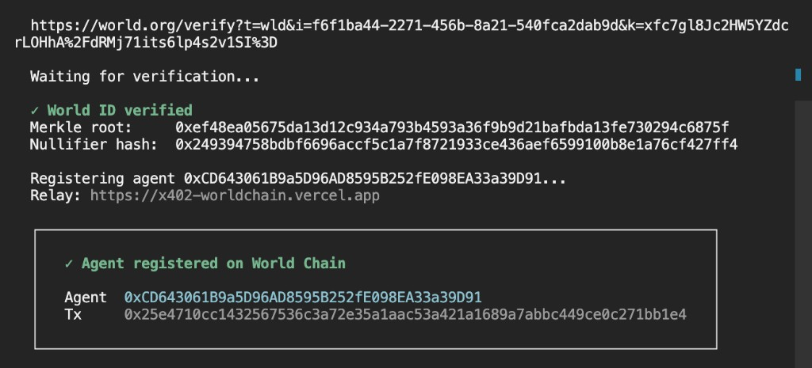
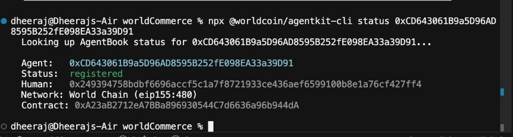

# World product feedback (AgentKit, AgentBook, World ID)

## Index

| Section | What it is |
|---|---|
| [1. Context](#1-context) | What I built and why AgentKit is in the settle path |
| [2. Disclaimer](#2-disclaimer) | Must-have vs could-have for **my** agentic commerce use case |
| [3. Actionables](#3-actionables-what-would-make-agent-commerce-work) | What to ship so an agent can spend for a human |
| [3.1 Scope card](#31-agentic-scope-card-must-have) | Mandate: outcomes + rails + expiry |
| [3.2 Guardrails](#32-guardrails-that-evaluate-a-proposed-spend-must-have) | Allow / deny / human step-up on a proposed spend |
| [3.3 Settle](#33-settle-against-the-card-not-against-a-boolean-must-have) | Money moves only if the action is in scope |
| [3.4 Could-have](#34-could-have-still-for-commerce) | Register, World ID as card issuer, drop discount samples |
| [4. Problems](#4-problems-i-hit-why-the-three-primitives) | What broke, with examples, mapped to 3.1–3.4 |
| [5. What worked](#5-what-was-actually-usable) | `lookupHuman`, then Steps 3–5 on a catalog route |
| [5.1 Proof](#51-proof-orb-world-id-bound-the-buyer-agent) | Screens: World ID verified + AgentBook registered |
| [6. Demo implementation log](#6-demo-implementation-log-what-shipped) | What the running app actually calls |

Continuity rubric / Orb vs Sandbox implementation log: [world-continuity-implementation-log.md](./world-continuity-implementation-log.md).

Jump by problem:

1. [Kit is an HTTP discount layer](#41-the-kit-is-shaped-for-api-discounts-i-needed-a-settle-gate)
2. [Lookup is a boolean](#42-lookup-is-a-yesno-commerce-needs-a-mandate)
3. [Gate is off-chain and cross-chain](#43-the-gate-is-off-chain-and-on-another-chain)
4. [No hold / release](#44-there-is-no-hold--release-for-money)
5. [Capacity is a trial counter](#45-capacity-is-an-http-trial-counter-not-a-human-spend-rail)
6. [No outcome bind](#46-continuity-is-registered-once-not-this-spend-matches-the-humans-outcome)
7. [Register ≠ lookup](#47-register-and-lookup-are-not-the-same-product)
8. [World ID never hits payout](#48-world-id-and-agentbook-do-not-meet-at-payout)
9. [Opaque errors](#49-failures-all-look-like-not-human-backed)
10. [Portal ≠ payout](#410-portal-onboarding-is-a-dashboard-win-not-a-payout-win)

---

## 1. Context

I built **worldCommerce**, an agentic shopping demo. A buyer agent searches Shopify, merchants sit under ENS names, the human approves a pick, then MockUSDC settles on Sepolia.

The trust problem is not “prove a human before chat.” It is this:

Merchants will pay a shopping agent to get chosen. If that payout can land without proving the agent is earning for a real person, it is bounty farming. If it can only land when the agent is human-backed, it is a commission to the human.

I used AgentKit two ways:

1. **Commerce incentive gate:** human-backed → release merchant commission to the buyer. Not human-backed → hold the commission (`lookupHuman` on `/api/settle`).
2. **World’s x402 access path (Steps 3–5):** buyer agent signs an `agentkit` header; `createAgentkitHooks` + `InMemoryAgentKitStorage` `free-trial` (3) gate `GET /api/agentkit/data`. Miss / exhausted → HTTP 402.

I wired `@worldcoin/agentkit` 0.2.1 (`lookupHuman`, `createAgentkitClient`, `createAgentkitHooks`, AgentBook on World Chain), World ID portal config, and a live settle path. Everything below is from that use case.

---

## 2. Disclaimer

This is not a general review of World.

It is what blocked **agentic commerce** for me, ranked as:

- **Must have** for my use case: without this, I could not do an honest payout gate.
- **Could have** for my use case: I shipped a workaround. The product would be better if World owned it.

Judges asked for blunt notes. These are problems I hit, not a claim that World is wrong for every app.

The kit I imported is an **x402 HTTP gate**. Identity is one on-chain read. Money modes are `free`, `free-trial`, and `discount`. My app is a **Sepolia ERC-20 settle** (purchase + merchant commission), not a coupon on an HTTP resource. A lot of the pain is that mismatch, not “I forgot to call an API.”

`lookupHuman` answers “is there a human somewhere behind this wallet.” Agentic commerce needs “this agent may spend toward **this human’s outcomes**, inside **these rails**, on **this purchase**.” That object does not exist in the kit. I faked pieces of it in the UI (budget, MCC, capacity string). None of that is AgentKit.

---

## 3. Actionables: what would make agent commerce work

Three primitives. Together they are the product I actually needed.

### 3.1 Agentic scope card (must have)

A signed, time-bounded card issued to agent A for human H. Not a boolean. A spend mandate.

Minimum fields:

- `humanId`, `agentWallet`
- `outcomes`: what success means for the human (example: `budget <= $10`, `minimize net cost to me`, `food MCC only`)
- `rails`: max spend, max per tx, merchant/MCC allow, where commission may land (`human` only, never the agent)
- `expiresAt`, `nonce`

**Example.** Human: “chocolates under $10, cheapest net cost to me.” Card says `maxSpendUsd: 10`, `outcome: minimize_nhc`, `commissionPayTo: human`. Merchant B bids 5% on a $12 bar. Merchant A bids 1% on an $8 bar. The card must make B illegal even though B pays the agent more. Today AgentKit cannot express that. My demo still picks `offers[0]` and prints a `$250` tier from env.

**Ship.** `issueScopeCard({ humanId, agentWallet, outcomes, rails })` → card. `getScopeCard(agentWallet)` → card or null. Persist it next to AgentBook, not in my `.env`.

### 3.2 Guardrails that evaluate a proposed spend (must have)

A function that takes the card plus the proposed action and returns allow, deny, or step-up (human must tap).

**Example.** Proposed action: pay merchant $8.49, release 1.7% commission to the buyer. Guardrails should check: still bound to H, under remaining spend, MCC ok, net cost is not worse than a cheaper eligible offer, commission pays the human not the agent. My UI already prints `budget`, `MCC allowed`, `capacity`. Those lines are copy. They do not stop the transfer.

**Ship.** `evaluateGuardrails(scopeCard, action) → { decision: "allow" | "deny" | "step_up", reason }`. `action` must include price, merchant, commission bps, payee, offer id. Deny must be the default if the card is missing or expired.

### 3.3 Settle against the card, not against a boolean (must have)

The money path has to see the same card. A Node `if (humanId)` next to a Sepolia `transfer` is not a gate.

**Example.** I pay the merchant in full, then skip or send commission from merchant1. If the process dies after purchase, there is nothing to replay. AgentKit never sees the tx. `lookupHuman` is on World Chain. USDC is on Sepolia.

**Ship.**

- `settleIfInScope({ scopeCard, purchase, commission })` or a documented Permit2/hold pattern: purchase and commission only move if `evaluateGuardrails` is allow (or the human stepped up).
- Commission payee must match `rails.commissionPayTo` (the human). If the agent tries to pocket the bid, deny.
- A proof the payment chain can check, or at least a verify that returns the **card**, not `true`. Fail closed on RPC errors (`lookup_unavailable` ≠ `not_registered`).

### 3.4 Could-have, still for commerce

- Register in the library, plus a public test AgentBook, so I do not default `AGENTKIT_ASSUME_HUMAN_BACKED=true`.
- One sentence in docs: AgentBook binds wallet to human. The **scope card** authorizes spend. World ID proof is how the human issues or refreshes the card. Today I configured action `human-backed-agent` and never called it on `/api/settle`.
- Do not lead commerce samples with `free` / `free-trial` / `discount`. Those push the exact demos the rubric rejects. Lead with scope card + guardrails + settle.

If you ship only `lookupHuman` forever, I can prove a sybil bit. I cannot prove the agent spent the way the human asked.

---

## 4. Problems I hit (why the three primitives)

Each item maps back to [section 3](#3-actionables-what-would-make-agent-commerce-work).

### 4.1 The kit is shaped for API discounts. I needed a settle gate.

**Must have.** Maps to [3.1](#31-agentic-scope-card-must-have) and [3.3](#33-settle-against-the-card-not-against-a-boolean-must-have).

`createAgentkitClient`, `createAgentkitHooks`, and `declareAgentkitExtension` sit on x402. `AgentkitMode` is only `free`, `free-trial`, or `discount`. There is no scope, no outcome, no commission rail.

**Example.** Kit happy path: signed header, server applies `mode: { type: "discount", percent: 10 }`. My path: buyer `transfer` on Sepolia, then a 1.7% rebate if AgentBook says yes. AgentKit never sees either tx. Using the kit as designed would be a verified-agent discount.

### 4.2 Lookup is a yes/no. Commerce needs a mandate.

**Must have.** Maps to [3.1](#31-agentic-scope-card-must-have).

`lookupHuman(address)` returns `string | null`. That is the whole AgentBook API I got.

**Example.** I needed “agent may settle up to $10 for human H this hour, cheapest NHC.” I got “registered: true.” I stuffed `$250` into `AGENTKIT_CAPACITY_TIER`.

### 4.3 The gate is off-chain and on another chain.

**Must have.** Maps to [3.3](#33-settle-against-the-card-not-against-a-boolean-must-have).

Lookup is always World Chain. Settlement is Sepolia. I cannot put that result in the USDC calldata. If my server lies, the chain still pays.

**Example.** `/api/settle` calls AgentBook, then skips or sends commission in the same process.

### 4.4 There is no hold / release for money.

**Must have.** Maps to [3.3](#33-settle-against-the-card-not-against-a-boolean-must-have).

No escrow, no hook on `transfer`.

**Example.** Buyer pays in full, then `if (!humanBacked) skip commission`. Crash between those steps and the rebate is gone.

### 4.5 Capacity is an HTTP trial counter, not a human spend rail.

**Could have** (must have if you keep “limits” on the Agent Kit checklist). Maps to [3.1](#31-agentic-scope-card-must-have) and [3.2](#32-guardrails-that-evaluate-a-proposed-spend-must-have).

`tryIncrementUsage(endpoint, humanId, limit)` lives in **my** storage. It counts API trial uses. It does not cap the human’s money.

**Example.** UI says `capacity: ok · tier $250`. An $8 cart and an $80 cart are the same to AgentKit.

### 4.6 Continuity is “registered once,” not “this spend matches the human’s outcome.”

**Must have.** Maps to [3.1](#31-agentic-scope-card-must-have) and [3.2](#32-guardrails-that-evaluate-a-proposed-spend-must-have).

AgentBook is wallet → human id. The HTTP header has a nonce. Neither binds cart, budget, or “do not pick a worse product for a fatter kickback.”

**Example.** Wallet registered last month. Agent picks the highest bidder. `lookupHuman` still passes. The human’s outcome (lowest net cost) is not in the kit.

### 4.7 Register and lookup are not the same product.

**Must have** for an honest demo. Maps to [3.4](#34-could-have-still-for-commerce).

Lookup works without Sandbox. Register is CLI + World App, not in `@worldcoin/agentkit`. Sandbox APIs were gated.

**Example.** I defaulted `AGENTKIT_ASSUME_HUMAN_BACKED=true` so Railway looks green. That can claim human-backed when AgentBook never said so.

### 4.8 World ID and AgentBook do not meet at payout.

**Could have.** Maps to [3.4](#34-could-have-still-for-commerce) (human issues the scope card via World ID).

World ID verify is not in this package. I created RP action `human-backed-agent` and never used it on settle.

**Example.** A judge asks where World ID is in the payment. It is in `.env`.

### 4.9 Failures all look like “not human-backed.”

**Could have.** Maps to [3.3](#33-settle-against-the-card-not-against-a-boolean-must-have) (fail closed with distinct errors).

**Example.** World Chain RPC timeout: I either assume human (unsafe) or hold commission (user thinks they are unverified). No `lookup_unavailable` vs `not_registered`.

### 4.10 Portal onboarding is a dashboard win, not a payout win.

**Could have.** Maps to [3.4](#34-could-have-still-for-commerce): portal should end on “issue scope card,” not a green RP badge.

**Example.** RP pending, poll status, key shown once. None of that moved merchant commission. I still invented the settle `if`.

---

## 5. What was actually usable

Live `lookupHuman` on World Chain, no Sandbox required. That is the piece the commission gate still uses.

### 5.1 Proof: Orb World ID bound the buyer agent

Register is **once**. Payout does not show a QR. These screens are the write that made `lookupHuman(0xCD64…)` return a human id. After this, `/api/settle` released commission on the live demo (`checkedVia: agentbook-live`, not the mock).

| | Value |
|---|---|
| Agent wallet | `0xCD643061B9a5D96AD8595B252fE098EA33a39D91` |
| Human (nullifier / AgentBook id) | `0x249394758bdbf6696accf5c1a7f8721933ce436aef6599100b8e1a76cf427ff4` |
| Merkle root | `0xef48ea05675da13d12c934a793b4593a36f9b9d21bafbda13fe730294c6875f` |
| Register tx (World Chain) | [`0x25e4710c…b1e4`](https://worldscan.org/tx/0x25e4710cc1432567536c3a72e35a1aac53a421a1689a7abbc449ce0c271bb1e4) |
| Relay | `https://x402-worldchain.vercel.app` |
| Status CLI | `npx @worldcoin/agentkit-cli status 0xCD64…` → **registered** |

**1. World ID verified, then AgentBook write**

**2. Same wallet resolves as registered (no second QR)**

The human behind this Orb is whoever signed the QR (mentor path when I did not have Orb). The demo agent is still **this** wallet. Judges can tap **AgentBook live** in the header to see these screens in the app.

---

I later wired the kit the way the integrate doc wants: `createAgentkitClient.createHeader` (Step 3) and `createAgentkitHooks` + `InMemoryAgentKitStorage` `free-trial` (Steps 4–5) on `GET /api/agentkit/data`. That is a real AgentKit HTTP gate. It still does not move Sepolia MockUSDC. When AgentBook has no human (no Orb register), the catalog correctly 402s and commission still **holds**. That is the honest demo.

For agent commerce, a boolean is not enough. I need a **scope card** (what the human wants), **guardrails** (may this action happen), and **settle against that card** (money only moves if the agent is still spending for that human). The kit’s money types (`free` / `free-trial` / `discount`) are the right shape for API access, not for merchant bids. I kept both: World’s access path on the catalog, my commission `if` on settle.

## 6. Demo implementation log (what shipped)

| World integrate step | In worldCommerce? | Where judges should look |
|---|---|---|
| 1. `npm install @worldcoin/agentkit` | Yes | `package.json` `^0.2.1` |
| 2. AgentBook register (QR / Orb World App) | **Done** (one-time) | [§5.1 screens](#51-proof-orb-world-id-bound-the-buyer-agent) · tx `0x25e4710c…` · demo chip **AgentBook live** |
| 2b. AgentBook resolve | Yes | `src/agentkit/verify.ts` `lookupHuman` |
| 3. `createAgentkitClient` wrap fetch | Yes (server-side buyer agent) | `src/agentkit/resource.ts` `probeBuyerAgentAccess` · UI `GET /api/agentkit/access` |
| 4. `createAgentkitHooks` + 402 resource | Yes (Node HTTP, not Hono) | `GET /api/agentkit/data` · `requestHook` |
| 4b. Hono + `@x402/hono` + live World Chain USDC facilitator settle | **No** | Docs sample. We return 402 JSON with `accepts` + `extensions.agentkit`. We do not settle World USDC on that 402. |
| 5. `InMemoryAgentKitStorage` `free-trial` uses: 3 | Yes | same module; process memory (resets on deploy) |
| 5b. Database-backed storage | **No** | World says InMemory is for local/demo |
| Commission incentive (our inversion) | Yes | `POST /api/settle` · merchant1 → buyer only if lookup passed |
| World ID Sandbox App / IDKit in UI | **Yes** | Header **Sandbox ID** · `GET/POST /api/worldid/*` · TestFlight World ID (Sandbox) |

**Value prop in the demo:** World’s kit gives human-backed agents **cheaper API access** (free-trial catalog). We also give them **merchant commission** at payout. Bots can still shop via `/api/turn`. They do not get the catalog grant or the bid.

**Orb:** required once to *write* AgentBook. That write is done (screens above). QR is not per purchase. TestFlight Sandbox is a separate IDKit path and still does not write AgentBook.
